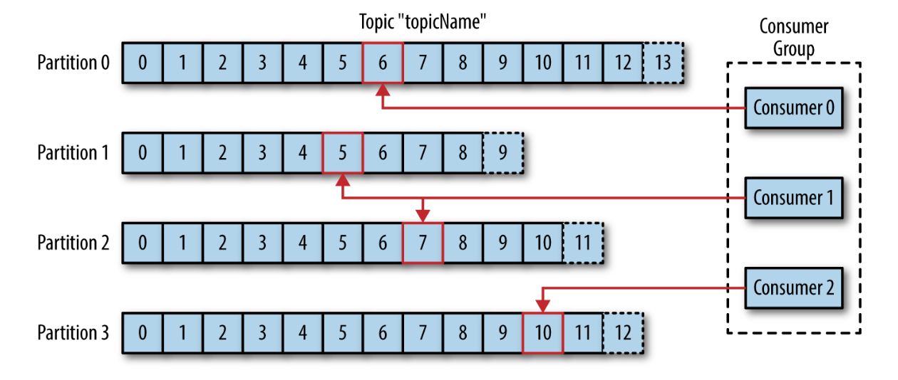
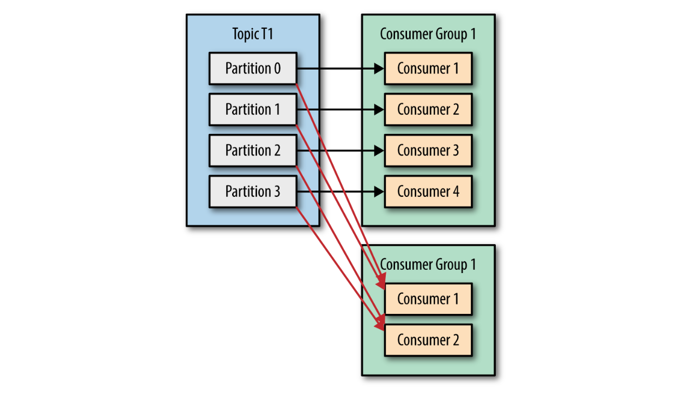

# Kafka

> **Kafka** is a distributed streaming platform

Documentation

* [Kafka](https://kafka.apache.org)

## Architecture

* Kafka is a publish/subscribe messaging system often described as a *distributed commit log* or *distributing streaming platform*

* The unit of data is called a **message**, which is simply an array of bytes and it can have a **key** used to assign partitions

* A **batch** is a collection of messages, all of which are being produced to the same topic and partition

* Messages are categorized into **topics** which are additionally broken down into a number of **partitions**

* Messages are written in an append-only fashion and are read in order from beginning to end. As a topic typically has multiple partitions, there is no guarantee of message time-ordering across the entire topic, just within a single partition

* A **stream** is considered to be a single topic of data, regardless of the number of partitions

* **Producers**, publishers or writers, create new messages to a specific topic. By default, the producer does not care what partition a specific message is written to and will balance messages over all partitions of a topic evenly


* **Consumers**, subscribers or readers, read messages. The consumer subscribes to one or more topics and reads the messages in the order in which they were produced. The consumer keeps track of which messages it has already consumed by keeping track of the **offset** of messages i.e. an integer value that continually
increases. Each message in a given partition has a unique offset stored either in Zookeeper or in Kafka itself



* Consumers work as part of a **consumer group**, which is one or more consumers that work together to consume a topic. The group assures that each partition is only consumed by one member. The mapping of a consumer to a partition is often called **ownership** of the partition by the consumer



* A single Kafka server is called a **broker**. The broker receives messages from producers, assigns offsets to them, and commits the messages to storage on disk. It also services consumers, responding to fetch requests for partitions and responding with the messages that have been committed to disk

* Kafka brokers are designed to operate as part of a **cluster**. Within a cluster of brokers, one broker will also function as the cluster **controller**. The controller is responsible for administrative operations, including assigning partitions to brokers and monitoring for broker failures. A partition is owned by a single broker in the cluster, and that broker is called the **leader** of the partition. A partition may be assigned to multiple brokers, which will result in
the partition being replicated. All consumers and producers operating on that partition must connect to the leader


* A key feature is that of **retention**. Brokers are configured with a default retention setting for topics, either retaining messages for some period of time or until the topic reaches a certain size in bytes. Once these limits are
reached, messages are expired and deleted

* **MirrorMaker** is a tool to coordinates multiple clusters or datacenters and replicate data

## Setup

Requirements

* [Base](docker/#base-image) docker image 
* [ZooKeeper](zookeeper) docker image

Build `devops/kafka` image
```bash
# change path
cd devops/kafka

# build image
docker build -t devops/kafka .

# create network
docker network create --driver bridge my_network
docker network ls
docker network inspect my_network

# start temporary zookeeper container [host:container]
docker run --rm \
  --name zookeeper \
  -p 12181:2181 \
  --network=my_network \
  devops/zookeeper
# access container
docker exec -it zookeeper bash

# start temporary kafka container [host:container]
docker run --rm \
  --name kafka \
  -p 19092:9092 \
  --network=my_network \
  -e ZOOKEEPER_HOSTS="zookeeper:2181" \
  devops/kafka
# access container
docker exec -it kafka bash

# paths
/opt/kafka
/opt/kafka/logs
/var/log/kafka
/var/lib/kafka/data
```

Alternatively use `docker-compose`
```bash
# change path
cd devops/kafka

# build base image
docker build -t devops/base ../base
# build + start zookeeper and kafka
docker-compose up

# access container
docker exec -it devops-zookeeper bash
docker exec -it devops-kafka bash
```

Example
```bash
docker exec -it kafka bash
cd /opt/kafka/bin

# create topic
./kafka-topics.sh --create --zookeeper zookeeper:2181 --replication-factor 1 --partitions 1 --topic test

# view topic
./kafka-topics.sh --list --zookeeper zookeeper:2181
./kafka-topics.sh --zookeeper zookeeper:2181 --describe --topic test

# produce
./kafka-console-producer.sh --broker-list kafka:9092 --topic test

# consume
./kafka-console-consumer.sh --bootstrap-server kafka:9092 --topic test --from-beginning
```

<br>
