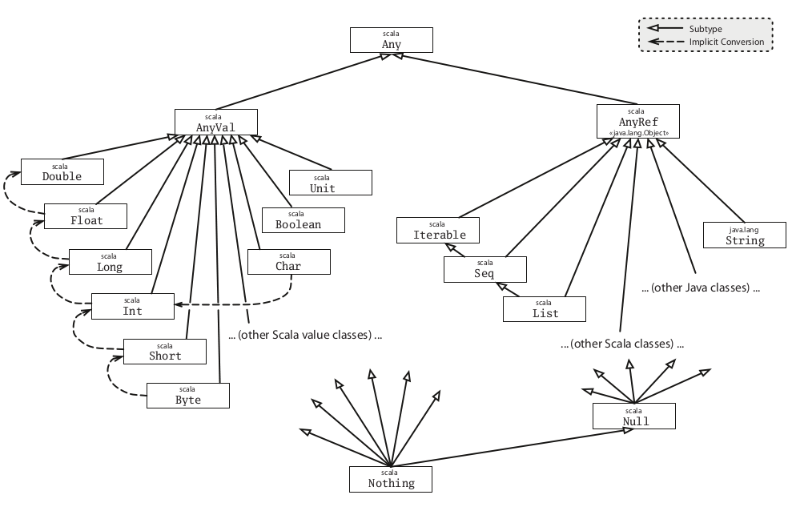

# Scala

## Resources

**Fundamentals**

* [Programming in Scala](https://amzn.to/2OAAgc3) (2016)(3rd) by Martin Odersky, Lex Spoon, and Bill Venners (Book)
* [Scala High Performance Programming](https://amzn.to/2Oy7QiS) (2016) by Vincent Theron, Michael Diamant (Book)
* [Akka in Action](https://amzn.to/2vsTesn) (2016) by Raymond Roestenburg, Rob Bakker, and Rob Williams (Book)

* [Tour of Scala](https://docs.scala-lang.org/tour/tour-of-scala.html)
* [Twitter Scala School](https://twitter.github.io/scala_school)
* [Scala Puzzlers](http://scalapuzzlers.com)
* [S-99: Ninety-Nine Scala Problems](http://aperiodic.net/phil/scala/s-99)
* [Scala Exercises](https://www.scala-exercises.org)
* [Scala for Project Euler](https://pavelfatin.com/scala-for-project-euler)
* [Scala Collections](https://docs.scala-lang.org/overviews/collections/introduction.html)
* [Scala Collections performance characteristics](https://docs.scala-lang.org/overviews/collections/performance-characteristics.html)
* [The Neophyte's Guide to Scala](https://danielwestheide.com/scala/neophytes.html)
* [Cheat Codes for Contravariance and Covariance](http://blog.originate.com/blog/2016/08/10/cheat-codes-for-contravariance-and-covariance)
* [Covariance and contravariance in Scala](http://blog.kamkor.me/Covariance-And-Contravariance-In-Scala)
* [The Scala Type System: Parameterized Types and Variances](https://blog.codecentric.de/en/2015/03/scala-type-system-parameterized-types-variances-part-1)

**FP readings**

* [Functional Programming for Mortals with Scalaz](https://leanpub.com/fpmortals) (2018) by Sam Halliday (Book)
* [Functional Programming in Scala](https://amzn.to/2OCFpQG) (2014) by Paul Chiusano and Runar Bjarnason (Book)
* [Functional Programming, Simplified](https://amzn.to/2OCFROS) (2017) by Alvin Alexander (Book)
* [Scala with Cats](https://underscore.io/books/scala-with-cats) (Book)
* [The Type Astronaut's Guide to Shapeless](https://underscore.io/books/shapeless-guide) (Book)
* [Why Functional Programming Matters](https://www.cs.kent.ac.uk/people/staff/dat/miranda/whyfp90.pdf) (Paper)
* [The Essence of the Iterator Pattern](https://www.cs.ox.ac.uk/jeremy.gibbons/publications/iterator.pdf) (Paper)
* [Applicative programming with effects](http://www.staff.city.ac.uk/~ross/papers/Applicative.pdf) (Paper)
* [Stack Safety for Free](http://functorial.com/stack-safety-for-free/index.pdf) (Paper)
* [Stackless Scala With Free Monads](http://blog.higher-order.com/assets/trampolines.pdf) (Paper)
* [Type Classes as Objects and Implicits](http://ropas.snu.ac.kr/~bruno/papers/TypeClasses.pdf) (paper)
* [Cats Infographic](https://github.com/tpolecat/cats-infographic)

**FP resources**

* [Functional Programming Basics](https://pragprog.com/magazines/2013-01/functional-programming-basics)
* [Functional Programming For The Rest of Us](http://www.defmacro.org/2006/06/19/fp.html)
* [The Downfall of Imperative Programming](https://www.fpcomplete.com/blog/2012/04/the-downfall-of-imperative-programming)
* [Parallelism and concurrency need different tools](http://yosefk.com/blog/parallelism-and-concurrency-need-different-tools.html)
* [Scala's Types of Types](https://ktoso.github.io/scala-types-of-types)
* [Algebraic Data Types in Scala](https://alvinalexander.com/scala/fp-book/algebraic-data-types-adts-in-scala)
* [What the Heck are Algebraic Data Types?](https://merrigrove.blogspot.com/2011/12/another-introduction-to-algebraic-data.html)
* [More on Sealed Traits in Scala](https://underscore.io/blog/posts/2015/06/04/more-on-sealed.html)
* [Generalized type constraints in Scala (without a PhD)](http://blog.bruchez.name/2015/11/generalized-type-constraints-in-scala.html)
* [First steps with monads in Scala](https://darrenjw.wordpress.com/2016/04/15/first-steps-with-monads-in-scala/)
* [Functors, Applicatives, And Monads In Pictures](http://adit.io/posts/2013-04-17-functors,_applicatives,_and_monads_in_pictures.html)
* [Demystifying the Monad in Scala](https://medium.com/@sinisalouc/demystifying-the-monad-in-scala-cc716bb6f534)
* [Category Theory for Programmers](https://bartoszmilewski.com/2014/10/28/category-theory-for-programmers-the-preface)
* [Stackless Scala](http://www.marcoyuen.com/articles/2016/09/08/stackless-scala-1-the-problem.html)
* [Overview of free monad in cats](https://blog.scalac.io/2016/06/02/overview-of-free-monad-in-cats.html)
* [ScalaFP: Firsthand With Scala-Cats](https://www.signifytechnology.com/blog/2018/07/scalafp-firsthand-with-scala-cats-monads-number-1-by-harmeet-singh)
* [Scala Cats library for dummies](https://medium.com/@abu_nadhr/scala-cats-library-for-dummies-part-1-8ec47af7a144)
* [An IO monad for cats](https://typelevel.org/blog/2017/05/02/io-monad-for-cats.html)
* [Rethinking MonadError](https://typelevel.org/blog/2018/04/13/rethinking-monaderror.html)
* [Shapeless for Mortals](http://fommil.com/scalax15/) (2015) by Sam Halliday (Talk)
* [Free monads - what? and why?](https://softwaremill.com/free-monads)
* [Free Monad examples](https://github.com/kenbot/free)

**Typeclass**

* [Type classes in Scala](https://blog.scalac.io/2017/04/19/typeclasses-in-scala.html)
* [Returning the "Current" Type in Scala](http://tpolecat.github.io/2015/04/29/f-bounds.html)
* [Typeclass 101: ad hoc polymorphism in scala](https://julien-truffaut.github.io/Typeclass)
* [All you don't need to know about Typeclasses](http://workday.github.io/assets/scala-exchange-type-classes)
* [Typeclasses 101](http://learnyouahaskell.com/types-and-typeclasses#typeclasses-101)
* [Scala/Haskell: A simple example of type classes](https://markhneedham.com/blog/2012/05/22/scalahaskell-a-simple-example-of-type-classes)
* [A Small Example of the Typeclass Pattern in Scala](http://www.casualmiracles.com/2012/05/03/a-small-example-of-the-typeclass-pattern-in-scala)

**Patterns**

* [The Aux Pattern](https://gigiigig.github.io/posts/2015/09/13/aux-pattern.html)
* [Cake pattern](https://medium.com/@itseranga/scala-cake-pattern-e0cd894dae4e)
* [Magnet pattern](http://spray.io/blog/2012-12-13-the-magnet-pattern)

**Other FP languages**

* [A practical introduction to functional programming](https://maryrosecook.com/blog/post/a-practical-introduction-to-functional-programming)
* [Learn You a Haskell for Great Good!](http://learnyouahaskell.com/chapters)
* [A Quick Tour of Haskell Syntax](http://prajitr.github.io/quick-haskell-syntax)
* [OCaml taste](https://ocaml.org/learn/taste.html)

**Blogs**

* [Typelevel](https://typelevel.org/blog)
* [Scalac](https://blog.scalac.io)
* [Signify](https://www.signifytechnology.com/blog)
* [Scala Times](https://scalatimes.com)
* [SoftwareMill](https://softwaremill.com/blog)

## FAQs

* [Scala FAQs](https://docs.scala-lang.org/tutorials/FAQ)

*What is the Scala hierarchy?*



*What is the difference between by-name and by-value parameters?*

A **by-value** parameter is evaluated before the method is invoked e.g. `(x: Int)` while a **by-name** parameter is not evaluated before the method is invoked, but each time the parameter is referenced inside the method e.g. `(x: => Int)`

*What are the differences between def val var lazy?*

* `def` defines a method
* `val` defines a fixed value, it is immmutable and eagerly initialized
* `var` defines a variable reference, it is mutable and it should be avoided
* `lazy` only initialised when required and as late as possible (deferred evaluation), default is strict and is not recomputed like by-name parameters

*What are Nothing Nil None Empty Null null Unit?*

* `Nothing` is a trait that is the bottom subtype of every subtype of `Any`
* `Nil` is an empty list that is defined as a `List[Nothing]`
* `None` is an empty option that is defined as a `Option[Nothing]`
* `Null` is a trait and is the bottom type similiar to `Nothing` but only for `AnyRef` not `AnyVal`
* `null` is an instance of the `Null` trait
* `Unit` is a subtype of `AnyVal`, it's only value is `()` and it is not represented by any object in the underlying runtime system. A method with return type `Unit` is analogous to a Java method which is declared `void`

*What is the uniform access principal?*

The uniform access principle states that variables, precomputed properties and parameterless functions should be accessed using the same syntax. Therefore not betraying whether they are implemented through storage or through computation. Scala supports this principle by not allowing parentheses to be placed at call sites of parameterless functions. A parameterless function definition `def` can be changed to a `val` or vice versa, without affecting client code

*What referentially transparent means?*

An expression `e` is **referentially transparent** if, for all programs `p`, all occurrences of `e` in `p` can be replaced by the result of evaluating `e` without affecting the meaning of `p`

*What is a pure function?*

A function `f` is **pure** if the expression `f(x)` is referentially transparent for all referentially transparent `x`. Hence a pure function is **modular** and **composable**

*What is a higher-order function?*

A **higher-order function** is a function that takes other functions as arguments or returns a function as result

*What is recursive function?*

A **recursive function** is a function which calls itself. With **head recursion**, the recursive call is not the last instruction in the function.

A **tail recursive function** is a special case of recursion in which the last instruction executed in the method is the recursive call. As long as the recursive call is in tail position, Scala detects and compiles it to the same sort of bytecode as would be emitted for a while loop

```scala
def factorial(n: Int): Int = {
  @tailrec
  def loop(index: Int, result: Int): Int = index match {
    case i if i == 0 => loop(1, 1 * result)
    case i if i < n => loop(i + 1, i * result)
    case i => i * result
  }
  loop(0, 1)
}
```

*What is a function literal?*

**Function literal** is a synonyms for **anonymous function**. Because functions are just ordinary Scala objects, we say that they are **first-class values**. A function literal is syntactic sugar for an object with a method called apply

```scala
val lessThan0 = (a: Int, b: Int) => a < b
val lessThan1 = (a, b) => a < b
val lessThan2 = new Function2[Int, Int, Boolean] {
  override def apply(a: Int, b: Int): Boolean = a < b
}
```

*What is a variadic function?*

A **variadic function** accepts zero or more arguments. It provides a little syntactic sugar for creating and passing a Seq of elements explicitly. The special `_*` type annotation allows to pass a Seq to a variadic method

```scala
sealed trait MyList[+A]
case object MyNil extends MyList[Nothing]
case class MyCons[+A](head: A, tail: MyList[A]) extends MyList[A]

object MyList {
  def apply[A](list: A*): MyList[A] =
    if (list.isEmpty) MyNil
    else MyCons(list.head, apply(list.tail: _*))
}

// usage
MyList(1, 2, 3, 4, 5)
```

*What is a value class?*

The [AnyVal](https://docs.scala-lang.org/overviews/core/value-classes.html) class can be used to define a **value class**, which is optimized at compile time to avoid the allocation of an instance

```scala
final case class Price(value: BigDecimal) extends AnyVal {
  def lowerThan(p: Price): Boolean = this.value < p.value
}
```

*What is autoboxing?*

The JVM defines primitive types (`boolean`, `byte`, `char`, `float`, `int`, `long`, `short` and `double`) that are *stack-allocated* rather than *heap-allocated*. When a generic type is introduced, for example, `scala.collection.immutable.List`, the JVM references an object equivalent, instead of a primitive type. For example, an instantiated list of integers would be heap-allocated objects rather than integer primitives. The process of converting a primitive to its object equivalent is called *boxing*, and the reverse process is called *unboxing*. Boxing is a relevant concern for performance-sensitive programming because boxing involves heap allocation. In performance-sensitive code that performs numerical computations, the cost of [boxing and unboxing](https://docs.oracle.com/javase/tutorial/java/data/autoboxing.html) can can create significant performance slowdowns

*What is the specialized annotation?*

**Specialization** with `@specialized` annotation, refers to the compile-time process of generating duplicate versions of a generic trait or class that refer directly to a primitive type instead of the associated object wrapper. At runtime, the compiler-generated version of the generic class (or, as it is commonly referred to, the specialized version of the class) is instantiated. This process eliminates the runtime cost of boxing primitives, which means that you can define generic abstractions while retaining the performance of a handwritten, specialized implementation although it has some [quirks](http://aleksandar-prokopec.com/2013/11/03/specialization-quirks.html)

*What is the switch annotation?*

In scenarios involving simple pattern match statements that directly match a value, using `@switch` annotation provides a warning at compile time if the switch can't be compiled to a tableswitch or lookupswitch which procides better performance, because it results in a branch table rather than a decision tree

*What is an Algebraic Data Type?*

In type theory, regular data structures can be described in terms of sums, products and recursive types. This leads to an algebra for describing data structures (and so-called algebraic data types). Such data types are common in statically typed functional languages

An **algebraic data type** (ADT) is just a data type defined by one or more data constructors, each of which may contain zero or more arguments. We say that the data type is the sum or union of its data constructors, and each data constructor is the product of its arguments, hence the name algebraic data type

Example

* these types represent a SUM type because Shape is a Circle OR a Rectangle
* Circle is a PRODUCT type because it has a radius
* Rectangle is a PRODUCT type because it has a width AND a height

```scala
sealed trait Shape
final case class Circle(radius: Double) extends Shape
final case class Rectangle(width: Double, height: Double) extends Shape
```

*How for-comprehensions is desugared? ([docs](https://docs.scala-lang.org/tour/for-comprehensions.html))*

```scala
// (1) works because "foreach" is defined
scala> for (i <- List(1, 2, 3)) println(i)
1
2
3

// (2) "yield" works because "map" is defined
scala> for (i <- List(1, 2, 3)) yield i*2
res2: List[Int] = List(2, 4, 6)

// (3) "if" works because "withFilter" is defined
scala> for (i <- List(1, 2, 3, 4); if i%2 == 0) yield i*2
res3: List[Int] = List(4, 8)

// (4) works because "flatMap" is defined
scala> for (i <- List(1, 2, 3, 4); j <- List(3, 4, 5, 6); if i == j) yield i
res4: List[Int] = List(3, 4)
```

*What is a Typeclass?*

A Typeclass is a programming pattern that allow to extend existing libraries with new functionality, without using traditional inheritance and without altering the original library source code using a combination of ad-hoc polymorphism, parametric polymorphism (type parameters) and implicits

*What is a Monoid?*

A Monoid is an algebraic type with 2 laws, a binary operation over that type, satisfying *associativity* and an *identity* element

* associative e.g `a + (b + c) == (a + b) + c`
* identity e.g. for sum is 0, for product is 1, for string is ""

```scala
trait Monoid[A] {
  // associativity
  // op(op(x, y), z) == op(x, op(y, z))
  def op(x: A, y: A): A

  // identity
  // op(x, zero) == op(zero, x) == x
  def zero: A
}

// example
val stringMonoid = new Monoid[String] {
  override def op(x: String, y: String): String = x + y
  override def zero: String = ""
}
```

Monoids have an intimate connection with lists and arguments of the same type, it doesn't matter if we choose `foldLeft` or `foldRight` when folding with a monoid because the laws of associativity and identity hold, hence this allows parallel computation

The real power of monoids comes from the fact that they compose, this means, for example, that if types A and B are monoids, then the tuple type (A, B) is also a monoid (called their product)

```scala
scala> List("first", "second", "third").foldLeft(stringMonoid.zero)(stringMonoid.op)
scala> List("first", "second", "third").foldRight(stringMonoid.zero)(stringMonoid.op)
res: String = firstsecondthird
```

*What is a Semigroup?*

A Semigroup is just the `combine` part of a Monoid. While many semigroups are also monoids, there are some data types for which we cannot define an empty element e.g. non-empty sequences and positive integers

```scala
trait Semigroup[A] {
  // or op
  def combine(x: A, y: A): A
}

trait Monoid[A] extends Semigroup[A] {
  // or zero
  def empty: A
}
```

*What is a Functor?*

Informally, a Functor is anything with a `map` method

```scala
// F is a higher-order type constructor or a higher-kinded type
trait Functor[F[_]] {
  def map[A, B](fa: F[A])(f: A => B): F[B]
}
```

*What is a Monad?*

Informally, a Monad is anything with a constructor and a flatMap method. A Monad is a mechanism for *sequencing computations*, all monads are functors but the opposite is not true.

A Monad is an implementation of one of the minimal sets of monadic combinators, satisfying the laws of associativity and identity

* unit and flatMap
* unit and compose
* unit, map and join

where the above are defined

```scala
def unit[A](a: => A): F[A]
def map[A, B](ma: F[A])(f: A => B): F[B]
def flatMap[A, B](ma: F[A])(f: A => F[B]): F[B]
def compose[A, B, C](f: A => F[B], g: B => F[C]): A => F[C]
def join[A](mma: F[F[A]]): F[A]

// Identity: compose(unit, f) = f = compose(f, unit)
// Associativity: compose(compose(f, g), h) = compose(f, compose(g, h))
```

A Monad provide a context for introducing and binding variables and performing variable substitution

```scala
object Monad {
  case class Id[A](value: A) {
    def map[B](f: A => B): Id[B] =
      Id(f(value))
    def flatMap[B](f: A => Id[B]): Id[B] =
      f(value)
  }

  val idMonad: Monad[Id] = new Monad[Id] {
    override def unit[A](a: => A): Id[A] =
      Id(a)

    override def flatMap[A, B](ma: Id[A])(f: A => Id[B]): Id[B] =
      ma.flatMap(f)
  }
}

Monad.Id("hello ").flatMap(a => Monad.Id("world").flatMap(b => Monad.Id(a + b)))

for {
  a <- Monad.Id("hello ")
  b <- Monad.Id("world")
} yield a + b

res: Monad.Id[String] = Id(hello world)
```

*What is a Semigroupal?*

A Semigroupal is a type class that allows to combine contexts. In contrast to flatMap, which imposes a strict order, Semigroupal parameters are independent of one another, which gives more freedom with respect to monads

```scala
trait Semigroupal[F[_]] {
  def product[A, B](fa: F[A], fb: F[B]): F[(A, B)]
}
```

*What is an Applicative?*

* all applicatives are functors
* all applicatives are a semigroupal
* all monads are applicative functors, viceversa is not true

```scala
// cats definition
trait Apply[F[_]] extends Semigroupal[F] with Functor[F] {
  def ap[A, B](ff: F[A => B])(fa: F[A]): F[B]
  def product[A, B](fa: F[A], fb: F[B]): F[(A, B)] =
    ap(map(fa)(a => (b: B) => (a, b)))(fb)
}

trait Applicative[F[_]] extends Apply[F] {
  def pure[A](a: A): F[A]
}

// red book definition
trait Applicative[F[_]] extends Functor[F] {
  // primitive combinators
  def map2[A, B, C](fa: F[A], fb: F[B])(f: (A, B) => C): F[C]
  def unit[A](a: => A): F[A]

  // derived combinators
  def map[A, B](fa: F[A])(f: A => B): F[B] =
    map2(fa, unit(()))((a, _) => f(a))
  def traverse[A, B](as: List[A])(f: A => F[B]): F[List[B]] =
    as.foldRight(unit(List[B]()))((a, fbs) => map2(f(a), fbs)(_ :: _))
}
```

<!--


Summary

* Semigroup: associativity
* Monoid: associativity + identity
* Functor: map
* Monad: any of 3 monadic laws (e.g. unit + flatMap) + associativity and identity (extends Functor)
* Applicative functor
* Traversable functor

* A function having the same argument and return type is sometimes called an endofunction

TODO Functor and Monad

* associative e.g. `x.flatMap(f).flatMap(g) == x.flatMap(a => f(a).flatMap(g))`
* monadic functions of types like `A => F[B]` are called Kleisli arrows

Laws
* Left and right identity
* Associativity
* Naturality of product

## Best practices and tips

```
# best practices
https://stackoverflow.com/questions/5827510/how-to-override-apply-in-a-case-class-companion

# type projector
https://typelevel.org/blog/2015/07/13/type-members-parameters.html

# jvm stack
https://www.artima.com/insidejvm/ed2/jvm8.html
https://alvinalexander.com/scala/fp-book/recursion-jvm-stacks-stack-frames
```

```scala
// to remember: foldLeft start from left (acc op xFirst) ==> (B, A)
// to remember: foldRight start from right (xLast op acc) ==> (A, B)
```

In Scala, all methods whose names end in : are right-associative. That is, the expression x :: xs is actually
the method call xs.::(x) , which in turn calls the data constructor ::(x,xs)

* curry function used to assist type inference when passing anonymous functions

* companion object
* a **variadic function** accepts zero or more arguments
* algebraic data type (ADT)

an API should form an algebra — that is, a collection of data types, functions over these data types, and importantly, laws or properties that express relationships between these functions

* volatile
* compare and swap
* javap
* diamond inheritance problem
* variance / covariance of type A

```scala

// + covariant
// List[Dog] is considered a subtype of List[Animal], assuming Dog is a subtype of Animal
sealed trait List[+A]
// Nothing is a subtype of all types
case object Nil extends List[Nothing]
case class Cons[+A](head: A, tail: List[A]) extends List[A]
```

-->

<br>
